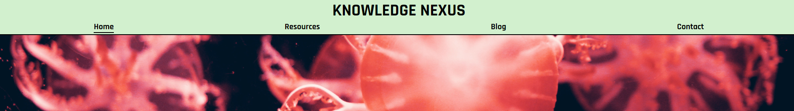
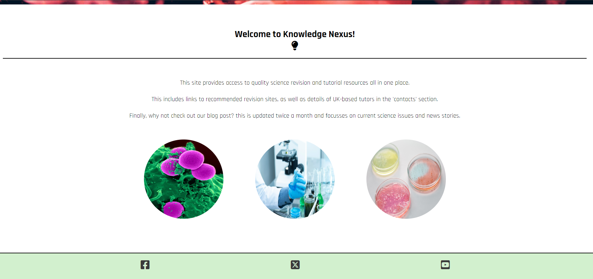
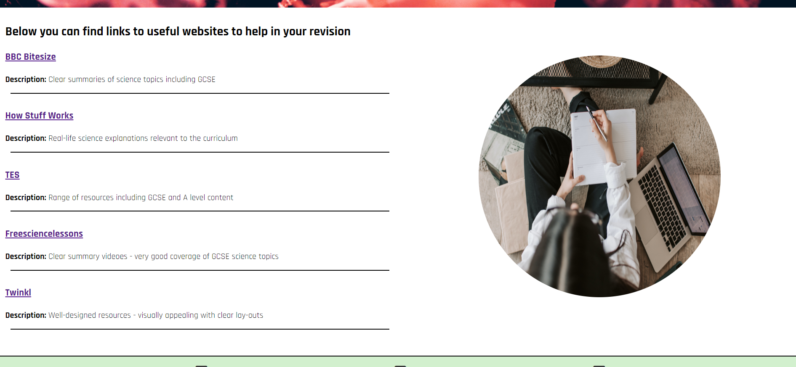
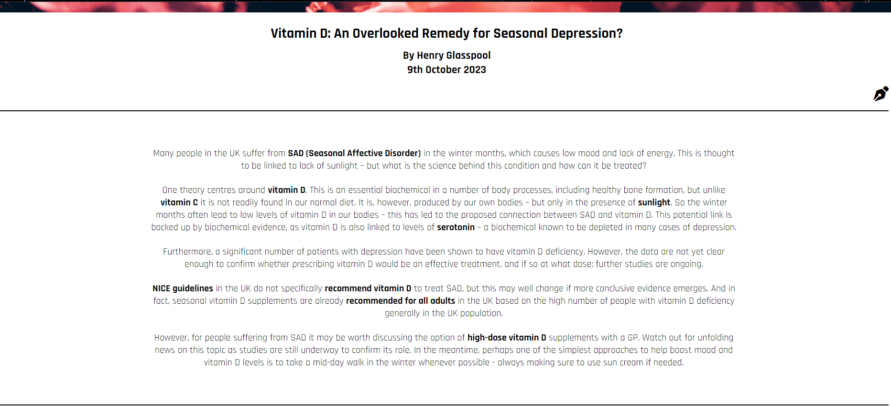
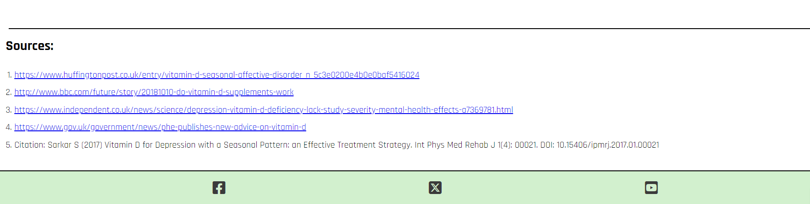
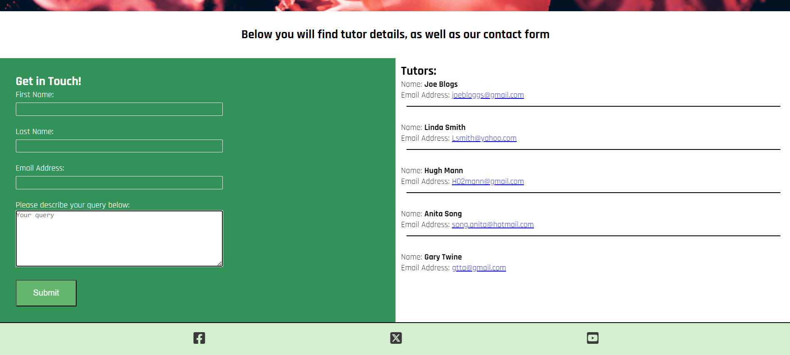
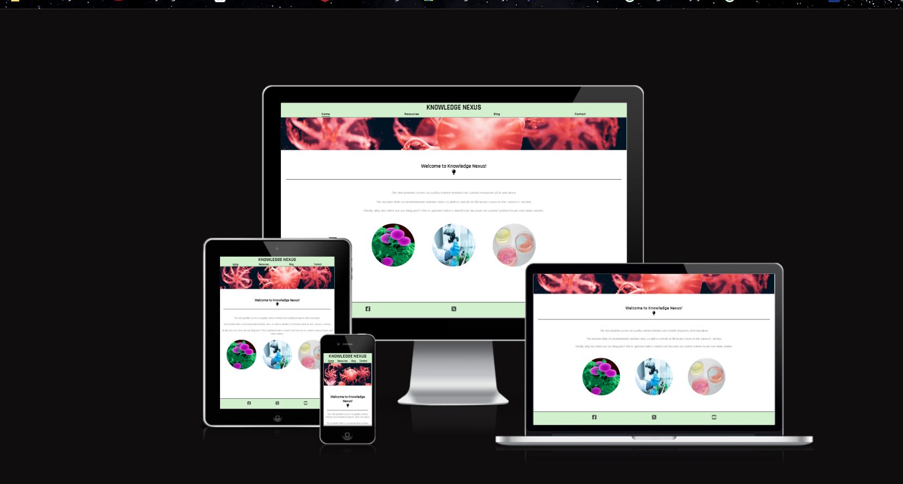
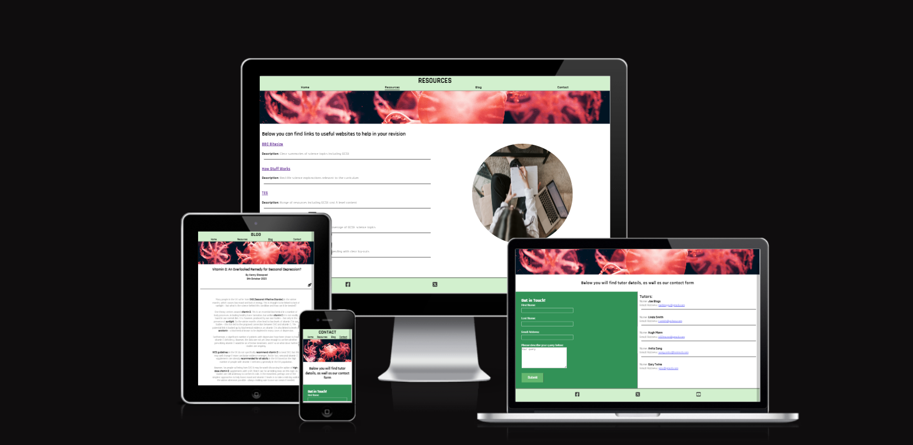

# Knowledge Nexus

## Contents:
1. Description
2. Design
3. Features
4. Testing
5. Deployment
6. Credits

--------------

## Description:

Knowledge Nexus is a science revision and learning resources tool for a secondary-school level. It's aim is to provide an all-in-one directory for revision resources, including links to various trusted external revision sites, as well as details and information about personal tutors in the UK England. The website also contains a blog, which discusses a science related topic that is either in the news, or relevent in some other way. 

The website is intended to make it easier to find reliable revision resources, rather than remembering and keeping track of these yourself. Additionally, there is a function for users to get in contact for additional information, particularly regarding tutoring. 

--------------

## Design: 

The colors for the website were chosen with readability and ease of use in mind, with the colours chosen providing contrast, whilst still being easy on the eye. The design of the site is simple and intuitive, and presents users with unambiguous navigation options. This is done through clear options visible at the top of the page.

The imagery used has a science theme throughout, and helps to convey the website's purpose clearly.

--------------
## Features:

### Home page:

The home page is simple, and immediately tells users what to expect from the site, and what it can be used for. By combining concise, minimal introductory text; as well as a selection of relevent images, the user's expectations are established, and they can now navigate through the site with ease.

The footer located at the bottom of the page provides links to Facebook, Twitter, and Youtube, allowing users to access additional content relevent to the site on these channels.

### Resources:

The resources page acts as a directory to a selection of useful external resources, including a short description about each one. This section is structured in a way that lets a user scan through these and select those most appropriate for them, an image that appears on larger screens adds color and visual appeal without distracting from the main content.

### Blog:

The blog page features a short article about a relevent science topic. It is displayed in a clear format with information broken down into digestible paragraphs, and key terms in bold. The title, author, and date of posting are clearly visable at the top of the page, and the information sources are also listed below the article - with links in the case of web sources.

### Contact:

Users can use the contact page to view details of science tutors, as well as submit their own queries - with a textarea feature to allow users provide detail to their request. The information on this page is displayed clearly, and is designed to allow users to very easily use the featured content. Clicking on the tutor emails immediately directs the user to their default email service, with a draft email generated.

--------------
**Testing:**

The website was tested thouroughly to ensure it functions and displays as indended. The below tools were used to test and validate the site.

- Github pages - a deployed version of the site was launched prior to the project end in order to make sure elements like interactivity and responsiveness were consistent outside of the building environment. All 
                 features functioned as intended. All social media, external website, and email links function correctly.

- W3C HTML validation - no errors are returned when passing the HTML pages through this validator

- W3C CSS validator - no errors are returned when passing the CSS document through this validator

- Lighthouse - a lighthouse score was generated for each page on the site, the results of which can be found belo2

  
Lighthouse scores:

    <b>Homepage</b>
    
    <b>Resources Page</b>
    
    <b>Blog Page</b>
    
    <b>Contact Page</b>
    

- Am I Responsive and Responsinator - using these websites it was possible to determine what the site would look like on different devices. All pages displayed as intended with the appropriate responsiveness.

 

- Bugs: during testing in the deployed environment, the following bugs were encountered and fixed:
  1. There was an issue with the content on the 'contact' page appearing too high on the screen when viewed on larger screen heights - this was fixed by adding a media query for longer screens.
  2. I found that the textarea feature on the 'contact' page was missing placeholder text, and there was no limit on the area resizing - this was fixed by limiting resize depending on screen width, and adding         placeholder text as part of the HTML
  3. The initial lighhouse scores for the page showed a poor rating for performance, this was due to the size of the images - this was fixed by using TinyPNG to compress the images to a smaller size, increasing performance.

--------------
**Deployment:**

This project was deployed with the 'pages' function of github, using the steps below:

1. Access the appropriate repository on github
2. Go to the 'settings' panel and select the 'pages' tab
3. Ensure the project is deployed from the correct source by selecting 'main branch' in the branch menu.
4. Save changes
5. Return to the 'code' panel, and refresh the repository once the build has finished.
6. The deployed version of the site is now accessible from the right hand menu

--------------
**Credits:**

This website was created by Henry Glasspool

All images used were taken from pexels.com
- hero image(red jellyfish) - Gabriel Peter 
- home page image 1(cells) - Pixabay
- home page image 2(lab) - Chokniti Khongchum
- home page image 3(petri dishes) - Edward Jenner
- resources page image(person studying) - Vlada Karpovich

Images were compressed using TinyPNG.com

All logos within the site, including those for social media links were souced from fontawesome.com

The favicon was generated using favicon.io

The content from the blog page was taken from these sources:
- https://www.huffingtonpost.co.uk/entry/vitamin-d-seasonal-affective-disorder_n_5c3e0200e4b0e0baf5416024
- http://www.bbc.com/future/story/20181010-do-vitamin-d-supplements-work
- https://www.independent.co.uk/news/science/depression-vitamin-d-deficiency-lack-study-severity-mental-health-effects-a7369781.html
- Citation: Sarkar S (2017) Vitamin D for Depression with a Seasonal Pattern: an Effective Treatment Strategy. Int Phys Med Rehab J 1(4): 00021. DOI: 10.15406/ipmrj.2017.01.00021
- https://www.gov.uk/government/news/phe-publishes-new-advice-on-vitamin-d

--------------
**Aknowledgements:**

I would like to thank my tutor Antonio for all his advice during the project, I would also like to thank my mother who was the inspiration behind the website concept.

